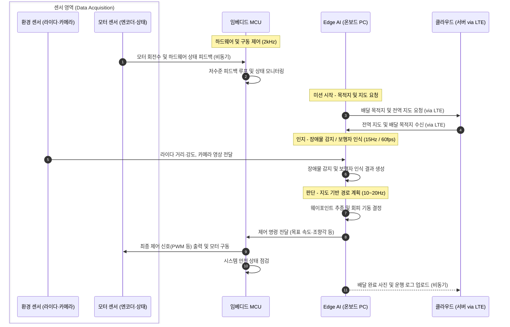
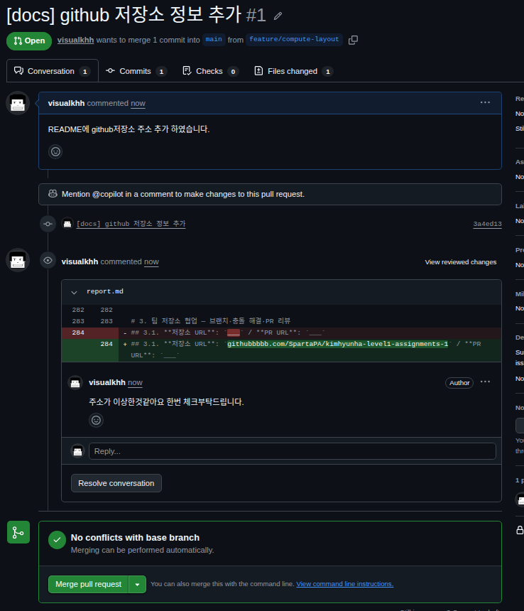
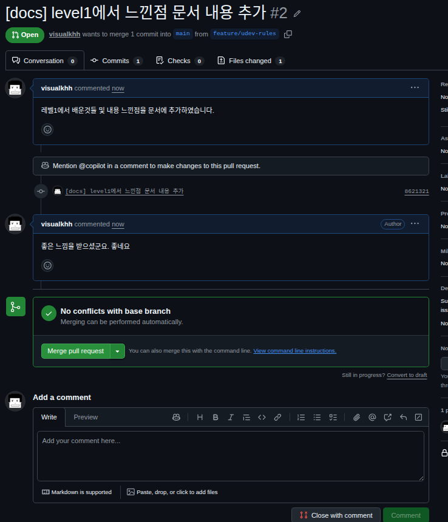

# 1. 배달 로봇의 연산 분담과 실시간성 설계

## 1.1 **연산 분담 배치표** — 작업 / 위치 / 지연 예산 / 데이터량 / 근거 (6행)
### 장치별 연산 분담 배치표
| 장치 (센서/통신) | 데이터 가정 및 형식 (바이트 구성 상세)                                                                                                                                                                | 지연 예산 및 주기 | 데이터 전송량 (크기 × 주기) |
| :--- |:------------------------------------------------------------------------------------------------------------------------------------------------------------------------------------------------------| :--- | :--- |
| **바퀴 엔코더** | • 좌측 바퀴 펄스: 4B 정수<br>• 우측 바퀴 펄스: 4B 정수<br>• 계산식: `좌측(4B) + 우측(4B) = 8B/샘플`                                                                                                   | • 지연 예산: $\le 0.5\text{ ms}$<br>• 주기: $2\text{ kHz}$ ($0.5\text{ ms}$)<br>• 빈도: 초당 2,000회 | $\approx 16\text{ KB/s}$ |
| **IMU** | • 3축 가속도: 각 4B 실수 $\times$ 3 = 12B<br>• 3축 각속도: 각 4B 실수 $\times$ 3 = 12B<br>• 3축 지자기: 각 4B 실수 $\times$ 3 = 12B<br>• 계산식: `가속도(12B) + 각속도(12B) + 지자기(12B) = 36B/샘플` | • 지연 예산: $\le 2.5\text{ ms}$<br>• 주기: $400\text{ Hz}$ ($2.5\text{ ms}$)<br>• 빈도: 초당 400회 | $\approx 14.4\text{ KB/s}$ |
| **2D 라이다** | • 각도별 거리: 4B + 반사 강도: 4B = 8B/포인트<br>• 스캔당 포인트 수: 360포인트<br>• 계산식: `포인트당 크기(8B) × 360포인트 = 2,880B/스캔`                                                             | • 지연 예산: $\le 66.7\text{ ms}$<br>• 주기: $15\text{ Hz}$ ($66.7\text{ ms}$)<br>• 빈도: 초당 15회 | $\approx 43.2\text{ KB/s}$ |
| **RGB 카메라** | • 해상도 픽셀 수: $1280 \times 720 = 921,600$ 픽셀<br>• 픽셀당 색상: R(1B) + G(1B) + B(1B) = 3B<br>• 계산식: `총 픽셀 수(921,600) × 픽셀당 바이트(3B) = 2,764,800B (약 2.76 MB)`                 | • 지연 예산: $\le 16.7\text{ ms}$<br>• 주기: $60\text{ fps}$ ($16.7\text{ ms}$)<br>• 빈도: 초당 60프레임 | $\approx 165.9\text{ MB/s}$ |
| **LTE 모듈** | • 배달 인증 사진 파일: 약 3 MB<br>• 운행 로그 텍스트 패킷: 약 0.05 MB<br>• 계산식: `배달 사진(3 MB) + 운행 로그(0.05 MB) = 약 3.05 MB/이벤트`                                                         | • 지연 예산: 수 초 이상<br>• 주기: 비동기 (Event-driven)<br>• 빈도: 필요 시 수시 전송 | 핑 $1 \sim 5\text{ ms}$, 최대 $95 \sim 100\text{ Mbps}$ |

### 작업별 연산 분담 배치표
| 작업 | 위치 | 지연 예산 | 데이터량 | 근거 (연산 분담 사유) |
| :--- | :--- | :--- | :--- | :--- |
| **모터 속도 제어** | 임베디드 (MCU) | $\le 0.5\text{ ms}$ ($2\text{ kHz}$) | $\approx 16\text{ KB/s}$ | 바퀴 엔코더와 모터 드라이버 간 즉각적인 피드백 제어가 필요하며, 외부 통신 지연 시 제어 불안정 및 폭주 발생 위험 방지 |
| **장애물 감지** | Edge AI (온보드 PC) | $\le 66.7\text{ ms}$ ($15\text{ Hz}$) | $\approx 43.2\text{ KB/s}$ | 2D 라이다 데이터를 기반으로 보도 주행 속도($1.5\text{ m/s}$) 기준 제동 거리 내에 장애물을 인지하고 충돌을 방지하기 위함 |
| **보행자 인식** | Edge AI (온보드 PC) | $\le 16.7\text{ ms}$ ($60\text{ fps}$) | $\approx 165.9\text{ MB/s}$ | 카메라 원시 영상을 클라우드로 전송하면 LTE 대역폭을 초과하므로, 온보드에서 실시간 객체 탐지 수행 필수 |
| **지도 기반 경로 계획** | Edge AI (온보드 PC) | $\le 100 \sim 200\text{ ms}$ ($5\text{ Hz} \sim 10\text{ Hz}$) | $\sim \text{수십 KB/s}$ | 전역 지도 기반 경로 및 웨이포인트 갱신은 통신이 끊겨도 안전 주행이 가능하도록 온보드에서 로컬 처리 |
| **배달 완료 사진 업로드** | 클라우드 (서버 via LTE) | 수 초 ($\text{Event-driven}$) | $\approx 3\text{ MB/이벤트}$ | 실시간 주행과 무관하며, LTE 모듈을 통한 사용자 앱 알림 및 서버 저장 목적이므로 지연 허용 가능 |
| **운행 로그 집계** | 클라우드 (서버 via LTE) | 백그라운드 비동기 | $\sim \text{MB/s}$ | 실시간성이 전혀 필요 없으며, 주행 종료 후 또는 주기적으로 관제 서버에 업로드하여 분석 및 모니터링 수행 |

### 주행 속도, 반응 지연 및 제동 거리 요약
| 구분 | 수치 및 계산 | 설명 |
| :--- | :--- | :--- |
| **보도 주행 규정 속도** | 초당 $1.5\text{ m}$ (시속 약 $5.4\text{ km}$) | 보행자 안전을 고려한 로봇의 보도 주행 속도 |
| **반응 지연 이동 거리** | **$0.10\text{ m}$ (10 cm)** | 라이다가 장애물을 인지하고 멈추기 전까지 0.0667초(66.7ms, 15Hz) 동안 로봇이 그대로 전진하는 거리 ($1.5 \times 0.0667 \approx 0.10\text{m}$) |
| **제동 거리** | **약 $0.56\text{ m}$ (56 cm)** | 브레이크가 작동한 후 완전히 멈출 때까지 밀려 나가는 거리 |
| **총 정지 거리** | **약 $0.66\text{ m}$ (66 cm)** | 장애물을 발견하고 멈추기 시작해 완전히 정지할 때까지의 총 이동 거리 (반응 지연 거리 + 제동 거리) |

*요약:* 만약 클라우드 통신 지연으로 인해 반응 시간이 수백 ms로 늘어나면 무방비로 전진하는 거리($0.10\text{m}$)가 훨씬 길어져 충돌 위험이 커집니다. 따라서 장애물 감지는 반드시 로봇 내부(Edge AI)에서 0.0667초(66.7ms, 15Hz) 안에 처리해야 합니다.

## 1.2 **카메라 원시 영상 전송량**: `165.9` MB/s — LTE 대비 판단: `실시간불가능`
- **원시 영상 전송량 계산**:
  - 해상도: $1280 \times 720$ (RGB, 픽셀당 3바이트) = $2,764,800\text{ 바이트/프레임} \approx 2.76\text{ MB/프레임}$
  - 프레임 레이트: $60\text{ fps}$
  - 총 전송량: $2.76\text{ MB} \times 60 = \mathbf{165.9\text{ MB/s}}$ ($\approx 1.33\text{ Gbps}$)
- **LTE 모듈 및 대역폭 대비 판단**:
  - 배달 로봇에 탑재된 **LTE 모듈**의 실제 성능은 핑 $1 \sim 5\text{ ms}$, 업로드 및 다운로드 속도 $95 \sim 100\text{ Mbps}$ 내외입니다. 따라서 $1.33\text{ Gbps}$에 달하는 카메라 원시 데이터 전송 요구량을 감당하는 것은 원천적으로 불가능합니다.
  - 만약 원시 영상을 LTE 모듈을 통해 클라우드로 계속 전송하려 할 경우, 네트워크 대역폭 포화로 인한 패킷 손실, 수백 밀리초 이상의 가변적 지연(Jitter), 음영 지역 발생 시 연결 단절 등이 일어나 즉각적인 충돌 회피나 보행자 인식이 불가능해집니다.
  - 따라서 **LTE 모듈은 실시간 제어·인지용이 아닌, 배달 완료 사진 업로드나 운행 로그 집계, 원격 관제와 같은 비실시간(Soft Real-time / Non-real-time) 데이터 전송 용도**로만 활용해야 합니다.


## 1.3. 인지·판단·제어 계층 매핑과 주기표

| 계층 (Layer) | 주요 작업 | 실행 위치 | 갱신 주기 (Period) | 데이터 흐름 및 역할 |
| :--- | :--- | :--- | :--- | :--- |
| **인지 (Perception)** | - 라이다 장애물 감지<br>- 카메라 보행자 인식 | Edge AI (온보드 PC) | - LiDAR: $66.7\text{ ms}$ ($15\text{ Hz}$)<br>- Camera: $16.7\text{ ms}$ ($60\text{ fps}$) | 라이다·카메라로부터 주변 환경 데이터를 수집하여 장애물·보행자 인식 결과를 생성 |
| **인지 (Perception)** | - IMU / 엔코더 상태 추정 | 임베디드 MCU | - IMU: $2.5\text{ ms}$ ($400\text{ Hz}$)<br>- Encoder: $0.5\text{ ms}$ ($2\text{ kHz}$) | IMU·엔코더 고주파 센서로부터 로봇의 자세·주행 상태 데이터를 수집 및 저지연 추정 |
| **판단 (Decision)** | - 지도 기반 경로 계획<br>- 웨이포인트 추종 및 회피 기동 결정 | Edge AI (온보드 PC) / 클라우드 연계 | $50\text{ ms} \sim 100\text{ ms}$ ($10\text{ Hz} \sim 20\text{ Hz}$) | 인지 계층의 결과와 전역 지도를 바탕으로 주행 경로를 연산하고 제어 지시 생성 |
| **제어 (Control)** | - 모터 속도 제어<br>- 구동기 저수준 피드백 루프 | 임베디드 (MCU / Motor Driver) | $0.5\text{ ms}$ ($2\text{ kHz}$) | 판단 계층의 목표 속도와 센서 피드백을 비교하여 모터 드라이버에 PWM 신호 등 최종 제어 명령 전달 |

*멀티레이트 데이터 흐름 (주요 작업 및 실행 위치별 시퀀스 다이어그램):*




## 1.4. Hard / Firm / Soft 실시간 분류 및 마감 초과 결과

| 분류 | 작업 항목 | 마감 초과 시 물리적 결과 |
| :--- | :--- | :--- |
| **Hard 실시간** | - 모터 속도 제어<br>- 장애물 감지 및 비상 정지 | 정해진 마감 시한을 놓치면 제어 루프 불안정 또는 긴급 제동 실패로 인해 **보행자 충돌, 로봇 파손, 인명/재산 피해** 등 치명적인 물리적 사고 발생 |
| **Firm 실시간** | - 보행자 인식<br>- 지도 기반 경로 계획 | 마감을 가끔 초과해도 즉각적인 충돌로 이어지지는 않으나, **주행 지연, 울컥거림, 비효율적인 회피 기동**으로 인해 서비스 품질 저하 및 간헐적 안전 경고 발생 |
| **Soft 실시간** | - 배달 완료 사진 업로드<br>- 운행 로그 집계 | 마감을 넘기더라도 안전이나 주행에 직접적 영향이 없으며, **사용자 앱의 알림 지연 또는 관제 서버의 로그 수집 지연** 정도의 기능적 불편만 발생 |


## 1.5. 주기 · 지연 · 지터 구분
- **주기 (Period)**: IMU 센서가 하드웨어 타이머에 의해 정확히 $2.5\text{ ms}$마다(400Hz) 한 번씩 데이터를 샘플링하여 출력하는 것처럼, 태스크나 센서가 반복 실행되는 고정된 시간 간격입니다.
- **지연 (Latency)**: 라이다 센서가 장애물을 감지한 시점부터 최종 모터 드라이버가 정지 명령을 받아 감속을 시작하기까지 소요된 총 경과 시간($\approx 66.7\text{ ms}$, 15Hz 1주기)입니다.
- **지터 (Jitter)**: 운영체제 스케줄링 부하 및 네트워크 지연 변동으로 인해, $66.7\text{ ms}$ 주기의 라이다 처리 태스크가 실제로는 $62\text{ ms}$에서 $71\text{ ms}$ 사이로 불규칙하게 흔들리는 시간 편차입니다.


----------------

# 2. 원격 접속(SSH)과 센서 장치 경로 고정
# 2.1. **고른 접속 대상**: `localhost / 가상머신` 중 `localhost` — 무비밀번호 접속 로그와 `who`·`echo $SSH_CONNECTION` 출력
```shell
pa@pa-Legion-Pro-5-16IAX10:/etc/udev/rules.d$ open .
pa@pa-Legion-Pro-5-16IAX10:/etc/udev/rules.d$ ssh-copy-id pa@localhost
/usr/bin/ssh-copy-id: INFO: attempting to log in with the new key(s), to filter out any that are already installed
/usr/bin/ssh-copy-id: INFO: 1 key(s) remain to be installed -- if you are prompted now it is to install the new keys
pa@localhost's password: 

Number of key(s) added: 1

Now try logging into the machine, with:   "ssh 'pa@localhost'"
and check to make sure that only the key(s) you wanted were added.

pa@pa-Legion-Pro-5-16IAX10:/etc/udev/rules.d$ ssh pa@localhost
Welcome to Ubuntu 22.04.5 LTS (GNU/Linux 6.8.0-138-generic x86_64)

 * Documentation:  https://help.ubuntu.com
 * Management:     https://landscape.canonical.com
 * Support:        https://ubuntu.com/pro

Expanded Security Maintenance for Applications is not enabled.

199 updates can be applied immediately.
To see these additional updates run: apt list --upgradable

154 additional security updates can be applied with ESM Apps.
Learn more about enabling ESM Apps service at https://ubuntu.com/esm

Last login: Thu Sep  3 09:16:26 2026
pa@pa-Legion-Pro-5-16IAX10:~$ who
pa       :0           2026-09-04 09:03 (:0)
pa       pts/6        2026-09-04 10:24 (127.0.0.1)
pa@pa-Legion-Pro-5-16IAX10:~$ echo $SSH_CONNECTION
127.0.0.1 56984 127.0.0.1 22
pa@pa-Legion-Pro-5-16IAX10:~$ systemctl status ssh
● ssh.service - OpenBSD Secure Shell server
     Loaded: loaded (/lib/systemd/system/ssh.service; enabled; vendor preset: >
     Active: active (running) since Fri 2026-09-04 09:44:39 KST; 40min ago
       Docs: man:sshd(8)
             man:sshd_config(5)
   Main PID: 15390 (sshd)
      Tasks: 1 (limit: 37548)
     Memory: 4.1M
        CPU: 76ms
     CGroup: /system.slice/ssh.service
             └─15390 "sshd: /usr/sbin/sshd -D [listener] 0 of 10-100 startups"

Sep 04 09:44:39 pa-Legion-Pro-5-16IAX10 sshd[15390]: Server listening on 0.0.0>
Sep 04 09:44:39 pa-Legion-Pro-5-16IAX10 sshd[15390]: Server listening on :: po>
Sep 04 09:44:39 pa-Legion-Pro-5-16IAX10 systemd[1]: Started OpenBSD Secure She>
Sep 04 10:24:33 pa-Legion-Pro-5-16IAX10 sshd[22282]: Connection closed by auth>
pa@pa-Legion-Pro-5-16IAX10:~$  ss -tlnp | grep :22
LISTEN 0      128               0.0.0.0:22         0.0.0.0:*                                         
LISTEN 0      128                  [::]:22            [::]:*                                         
pa@pa-Legion-Pro-5-16IAX10:~$ 
```
> 판독: `ssh-copy-id` 당시 1회는 비밀번호 입력(`Accepted password`)이 정상이며, 그 다음 접속부터 비밀번호 입력 없이 들어간 `Accepted publickey` 로그가 무비밀번호 접속의 증빙이다. `who`의 `pts/6 (127.0.0.1)` + `$SSH_CONNECTION=127.0.0.1 ... 22`가 원격 세션(ssh 데몬 경유)임을 증명한다.
- ssh 서버 설치
```shell
sudo apt update && sudo apt install -y openssh-server
sudo systemctl enable --now ssh
# 서비스 강제 실행할떄 systemctl status start ssh
systemctl status ssh
ss -tlnp | grep :22
```

## 2.2. **개인키·공개키 중 서버에 등록하는 것**: `public key` — 안전한 이유
- 안전한 이유: 개인키는 클라이언트에만 두고 공개키만 서버(`~/.ssh/authorized_keys`)에 등록하므로, 공개키가 노출돼도 개인키 없이는 인증이 성립하지 않는다.
- 자신의 키생성
```shell
ssh-keygen -t rsa -b 4096
ssh-copy-id pa@localhost
ssh pa@localhost
```
- server쪽에 public 키 등록
```shell
ssh-copy-id pa@localhost
```

- 수동등록
```sheel
# my
# 내가 가진 public key  (ex: ssh-rsa AAAAB3Nza...)
cat ~/.ssh/id_rsa.pub
```
```shell
# 대상 서버
mkdir -p ~/.ssh
chmod 700 ~/.ssh
# authorized_keys 파일에 복사해둔 publicㅋ키 붙여넣음
nano ~/.ssh/authorized_keys
chmod 600 ~/.ssh/authorized_keys
```

## 2.3. **원격 단일 명령 실행과 `scp` 전송 출력**
- 원격 단일 명령 실행
```shell
pa@pa-Legion-Pro-5-16IAX10:/etc/udev/rules.d$ ssh pa@localhost 'uname -a'
Linux pa-Legion-Pro-5-16IAX10 6.8.0-138-generic #138~22.04.1-Ubuntu SMP PREEMPT_DYNAMIC Fri Aug  7 13:43:15 UTC  x86_64 x86_64 x86_64 GNU/Linux
pa@pa-Legion-Pro-5-16IAX10:/etc/udev/rules.d$ 
```
- scp
```shell
pa@pa-Legion-Pro-5-16IAX10:~/workspaces/pa/source/physicalai-lv1-assignments$ scp README.md pa@localhost:~/
README.md                                                              100% 1889     1.1MB/s   00:00    
pa@pa-Legion-Pro-5-16IAX10:~/workspaces/pa/source/physicalai-lv1-assignments$ cd ~/
pa@pa-Legion-Pro-5-16IAX10:~$ ll | grep READ
-rw-rw-r--  1 pa   pa    1889 Aug 24 16:34 README.md
pa@pa-Legion-Pro-5-16IAX10:~$ 
```


## 2.4. **두 장치를 구분한 속성**: 라이다 `ATTR{loop/backing_file} (값: */lidar.img*)` / IMU `ATTR{loop/backing_file} (값: */imu.img*)`
```shell
# loop dev 식별자 알아내기
udevadm info --attribute-walk /dev/loop17 | grep "loop/backing_file"

# 또는 진짜 장치의 고유 식별자(제조사 ID, 제품 ID, 시리얼) 알아내기
#udevadm info -a -n /dev/ttyUSB0 | grep -E "idVendor|idProduct|serial" | head -3
```
## 2.5. **작성한 udev 규칙 2개** + **규칙 키 설명표**
```shell
# fake sensor 만들고 연결하기
mkdir -p ~/fake_sensors && cd ~/fake_sensors
cd fake_sensors/
truncate -s 10M lidar.img imu.img

# 보통 backing_file이름으로 구분하지만, 여기서는 UUID로 구분  리눅스 버전에따라 나오는거 있고 안나오는곳있다 
mkfs.ext4 -U "11111111-1111-1111-1111-111111111111" lidar.img
mkfs.ext4 -U "22222222-2222-2222-2222-222222222222" imu.img

# UUID 확인
sudo blkid /home/pa/fake_sensors/lidar.img
sudo blkid /home/pa/fake_sensors/imu.img

sudo losetup -f --show lidar.img 
/dev/loop16
sudo losetup -f --show imu.img 
/dev/loop17

# 해지방법
# sudo losetup -d /dev/loop17

# loop dev 식별자 알아내기 (진짜 장치라면 제조사 ID, 제품 ID, 시리얼 등으로도 가능 | grep -E "idVendor|idProduct|serial" )
udevadm info --attribute-walk -n /dev/loop17 


# rules 등록 경로변하지않게 하기위해 
vi /etc/udev/rules.d/99-robot-sensor.rules
```
file: /etc/udev/rules.d/99-robot-sensor.rules
```text
SUBSYSTEM=="block", ENV{ID_FS_UUID}=="11111111-1111-1111-1111-111111111111", SYMLINK+="robot_lidar", MODE="0660", GROUP="dialout"
SUBSYSTEM=="block", ENV{ID_FS_UUID}=="22222222-2222-2222-2222-222222222222", SYMLINK+="robot_imu", MODE="0660", GROUP="dialout"
```
- /etc/udev/rules.d/ 안에 우리가 만든 규칙 파일을 넣어두면, 리눅스 시스템(udev 데몬)이 이걸 알아서 인식

```shell
# 다시 reload
sudo udevadm control --reload
sudo udevadm control --reload-rules
# trriger
sudo udevadm trigger
```


6. **순서를 바꿔 재연결한 뒤 `ls -l /dev/robot_*` 결과**
```shell
# 1) 장치 해제  및 sudo losetup -d /dev/loopN
# 재대로 설정됐다면 순서가 안바뀜.
ls -l /dev/robot_*
lrwxrwxrwx 1 root root 9  8월 24 17:10 /dev/robot_lidar -> loop16
lrwxrwxrwx 1 root root 9  8월 24 17:10 /dev/robot_imu -> loop17
```
- 새로고침
```shell
sudo udevadm control --reload-rules
```

7. **실제 USB 센서용 규칙 초안과 구분 근거**
```shell
# 1) 장치의 고유 식별자(제조사 ID, 제품 ID, 시리얼) 알아내기
udevadm info -a -n /dev/ttyUSB0 | grep -E "idVendor|idProduct|serial" | head -3

# 2) /etc/udev/rules.d/99-robot.rules 작성 (sudo 필요)
#    idVendor 10c4, idProduct ea60인 장치를 /dev/robot_lidar로 링크
SUBSYSTEM=="tty", ATTRS{idVendor}=="10c4", ATTRS{idProduct}=="ea60", SYMLINK+="robot_lidar", MODE="0666"
SUBSYSTEM=="tty", ATTRS{idVendor}=="10c5", ATTRS{idProduct}=="ea50", SYMLINK+="robot_imu", MODE="0666"

# 3) 규칙 재적용
sudo udevadm control --reload-rules && sudo udevadm trigger

# 4) 확인 
udevadm info -a -n /dev/robot_lidar
```


# 3. 팀 저장소 협업 — 브랜치·충돌 해결·PR 리뷰
## 3.1. **저장소 URL**: `https://github.com/SpartaPA/kimhyunha-level1-assignments-1` / **PR URL**: `https://github.com/SpartaPA/kimhyunha-level1-assignments-1/pull/1`
- [저장소](https://github.com/SpartaPA/kimhyunha-level1-assignments-1)
- [PR](https://github.com/SpartaPA/kimhyunha-level1-assignments-1/pull/1)

## 3.2. **PR 리뷰 코멘트와 반영 커밋** (캡처 또는 링크)

[pr-1](https://github.com/SpartaPA/kimhyunha-level1-assignments-1/pull/1)


[pr-2](https://github.com/SpartaPA/kimhyunha-level1-assignments-1/pull/2)

## 3.3. **충돌이 난 파일과 줄**: `<<<, ===, >>>` — 충돌 표식의 뜻과 해결 방법
```text
<<<<<<< HEAD  (또는 브랜치명)
(지금 얹으려고 하는 지금 체크아웃한 쪽 현재 브랜치의 최신 코드 C)
=======
(내가 짠 내 커밋 A'의 코드)
>>>>>>> 내 커밋 메시지 또는 해시
```
```shell
# 1 충돌해결  <<<<, ====, >>>> 없이  사용자가 직접 충돌 해결
# 2 git 처리 
git add file 
git commit -m "충돌 해결 메시지"
git push
# 3 pull request and merge
```
- [충돌해결 link](https://github.com/SpartaPA/kimhyunha-level1-assignments-1/pull/3)

## 3.4. **merge 방식 이력 그래프** / **rebase 방식 이력 그래프** (두 출력 비교)
1. merge
- 장점: 두 브랜치를 그대로 보전하면서 합치는 방식 합치는 순간  merge Commit 이생겨서 내역을 확인할수 있다.(추적용이)
- 단점: 머지커밋이 많아지기때문에 커밋로그가 많아져 복잡해 질수 있다.
2. rebase
- 장점: 나의 브랜치의 기준 즉 base를 재설정한다  상대방의 브랜치의 가장 최신으로 내것을 짤라 옮겨 붙이는 방식  로그가 깔끔해지고 상대 브랜치에서부터 시작한 효과를 얻는다. (머지커밋안생김)
- 단점: 충돌이 났을때 나의 커밋들처음부터 하나씩 다 충돌해결을 해야한다. 충돌시 복잡해짐
3. 그래프 비교
```shell
# merge 그래프
* | d89cfe2 [docs] github 저장소 정보 추가
* |   ada81fb Merge pull request #2 from SpartaPA/feature/udev-rules
|\ \  
| * | 8621321 (origin/feature/udev-rules, feature/udev-rules) [docs] level1에서 느낀점 문서 내용 추가
|/ /  
| * 209a2aa [docs] 트러블 메이커가 문서 안내 페이지 팀저장소 협업 부분
|/  
| * d73b949 (origin/feature/compute-layout, feature/compute-layout) [fixed] level1에서 느낀점 문서 내용 추가 수정
| * 3a4ed13 [docs] github 저장소 정보 추가
|/  
* 2b35462 initialized
* b436ce9 initialized

# rebase 전 
pa@pa-Legion-Pro-5-16IAX10:~/workspaces/pa/source/kimhyunha-level1-assignments-1$ git log --oneline --decorate --graph --all
* 53cbb6f (origin/main, main) [docs] systemctl 명령어추가
| * de6df24 (HEAD -> feature/rebase-test) [docs] 그래프 비교 내용 추가
|/  
* 5517366 [docs] 문서 내용 추가 및 report 내용 추가
*   980c5f9 Merge pull request #3 from SpartaPA/feature/trouble-maker
|\  
| *   132429b (origin/feature/trouble-maker) Merge branch 'main' into feature/trouble-maker
| |\  
| |/  
|/|   
* | d566ad3 [fixed] level1에서 느낀점 문서 내용 추가 수정
* | d89cfe2 [docs] github 저장소 정보 추가
* |   ada81fb Merge pull request #2 from SpartaPA/feature/udev-rules
|\ \  
| * | 8621321 (origin/feature/udev-rules, feature/udev-rules) [docs] level1에서 느낀점 문서 내용 추가
|/ /  
| * 209a2aa [docs] 트러블 메이커가 문서 안내 페이지 팀저장소 협업 부분
|/  
| * d73b949 (origin/feature/compute-layout, feature/compute-layout) [fixed] level1에서 느낀점 문서 내용 추가 수정
| * 3a4ed13 [docs] github 저장소 정보 추가
|/  
* 2b35462 initialized
* b436ce9 initialized


###################
# rebase 후
pa@pa-Legion-Pro-5-16IAX10:~/workspaces/pa/source/kimhyunha-level1-assignments-1$ git log --oneline --decorate --graph --all
* dc78d42 (HEAD -> feature/rebase-test) [docs] 그래프 비교 내용 추가
* 53cbb6f (origin/main, main) [docs] systemctl 명령어추가
* 5517366 [docs] 문서 내용 추가 및 report 내용 추가
*   980c5f9 Merge pull request #3 from SpartaPA/feature/trouble-maker
|\  
| *   132429b (origin/feature/trouble-maker) Merge branch 'main' into feature/trouble-maker
| |\  
| |/  
|/|   
* | d566ad3 [fixed] level1에서 느낀점 문서 내용 추가 수정
* | d89cfe2 [docs] github 저장소 정보 추가
* |   ada81fb Merge pull request #2 from SpartaPA/feature/udev-rules
|\ \  
| * | 8621321 (origin/feature/udev-rules, feature/udev-rules) [docs] level1에서 느낀점 문서 내용 추가
|/ /  
| * 209a2aa [docs] 트러블 메이커가 문서 안내 페이지 팀저장소 협업 부분
|/  
| * d73b949 (origin/feature/compute-layout, feature/compute-layout) [fixed] level1에서 느낀점 문서 내용 추가 수정
| * 3a4ed13 [docs] github 저장소 정보 추가
|/  
* 2b35462 initialized
* b436ce9 initialized

```

## ***3.5 언제 merge 를, 언제 rebase 를 쓸지***  - 3줄 이내또
- merge: 여러명이서 같은 공용 브랜치에 머지를 할떄
- rebase: 혼자 사용중인 개인 브랜치에서 작업할떄  최신 브랜치 기준으로 깔끔하개 정돈 하고싶을때  (컨텍스트가 겹치지 않을때)


# 기타
## git commit 메시지 컨벤션
- feat : 새로운 기능 추가
- fix : 버그 수정
- docs : 문서 수정
- style : 코드 포맷팅, 세미콜론 누락, 코드 변경이 없는 경우
- refactor : 코드 리펙토링
- test : 테스트 코드, 리펙토링 테스트 코드 추가
- chore : 빌드 업무 수정, 패키지 매니저 수정


# 느낀점 및 경험
- 센서장비가 없을떄 더미(loop) 처리하여 테스트 하는 개념
- 장치 착탈한뒤 바뀌는 번호를 fixed시키는거
- 피지컬 개발시  설계와 개념 각각 영역에맞는 구역에서(muc, cloud, embedded..) 설계