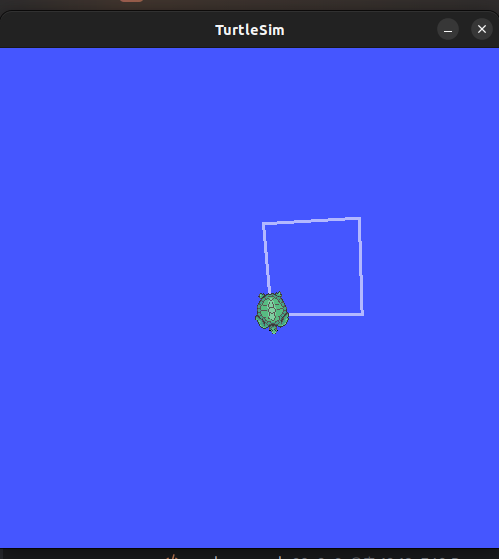
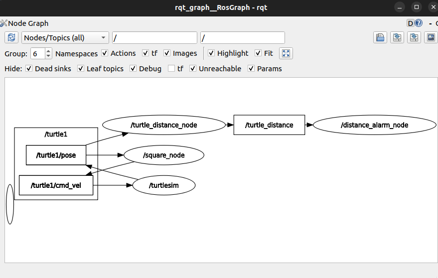
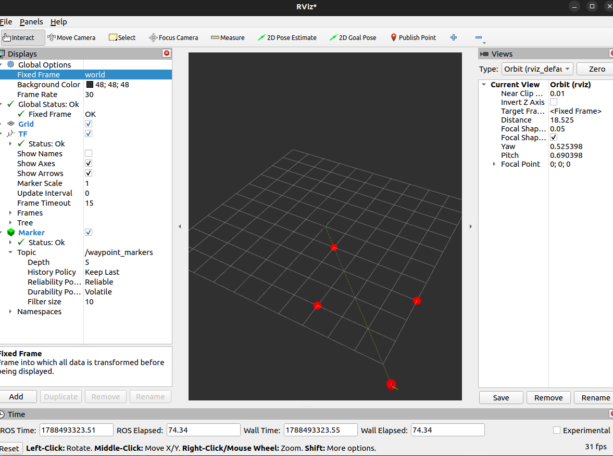

# 모듈 ② 과제 — turtlesim 기반 C++·Python ROS2 패키지 개발

## 1. C++ 빌드 체계 세우기 — g++ 다중 파일 빌드와 CMake 전환
### 결과물
- [CMakeLists.txt](cpp_basics/CMakeLists.txt)

### 답안 템플릿
1. **수동 2단계 빌드 명령** (터미널 입력)
```shell
g++ -Wall -Wextra -std=c++17 -c Motor.cpp -o Motor.o
g++ -Wall -Wextra -std=c++17 -c main.cpp -o main.o
g++ Motor.o main.o -o motor_app
motor_app
```

```shell
# 그냥 하나만 바로 빌드하고 실행할때
g++ -Wall -std=c++17 stop_distance.cpp -o stop_distance && ./stop_distance 5 1
```

2. **`undefined reference` 에러 메시지** (출력) — 컴파일 에러와의 차이 설명
```shell
(.venv) pa@pa-Legion-Pro-5-16IAX10:~/workspaces/pa/source/kimhyunha-level1-assignments/assignment-2/cpp_basics$ g++  main.o -o motor_app
/usr/bin/ld: main.o: in function `main':
main.cpp:(.text+0x103): undefined reference to `Motor::Motor(int)'
/usr/bin/ld: main.cpp:(.text+0x118): undefined reference to `Motor::setRpm(double)'
/usr/bin/ld: main.cpp:(.text+0x124): undefined reference to `Motor::printStatus() const'
collect2: error: ld returned 1 exit status
```
- 컴파일 에러 (Compilation Error): 소스 코드(.cpp) 내에 문법적 오류(오타, 세미콜론 누락, 잘못된 타입 등)가 있을 때 컴파일러(g++ -c) 단계에서 발생. 코드가 기계어 오브젝트 파일로 번역되는 과정 자체를 실패
- 링커 에러 / Undefined Reference (Linker Error): 문법은 완전히 맞아서 컴파일러가 main.o 같은 오브젝트 파일로 번역하는 데는 성공 하지만 최종 실행 파일을 만들기 위해 링커(ld)가 함수나 클래스의 실제 구현체(Motor.o 등)를 결합(Link)하려 할 때, 해당 심볼의 실제 정의를 찾지 못해 발생합니다. 즉, *"선언은 헤더를 통해 확인했으나, 몸통(구현부)이 어디 있는지 찾을 수 없다" 따라서 실행파일이만들어지지 않음

3. **CMake 빌드 출력** (터미널 출력)
```shell
(.venv) pa@pa-Legion-Pro-5-16IAX10:~/workspaces/pa/source/kimhyunha-level1-assignments/assignment-2/cpp_basics$ mkdir -p build && cd build
(.venv) pa@pa-Legion-Pro-5-16IAX10:~/workspaces/pa/source/kimhyunha-level1-assignments/assignment-2/cpp_basics/build$ cd bu
bash: cd: bu: 그런 파일이나 디렉터리가 없습니다
(.venv) pa@pa-Legion-Pro-5-16IAX10:~/workspaces/pa/source/kimhyunha-level1-assignments/assignment-2/cpp_basics/build$ cmake ..
-- The C compiler identification is GNU 11.4.0
-- The CXX compiler identification is GNU 11.4.0
-- Detecting C compiler ABI info
-- Detecting C compiler ABI info - done
-- Check for working C compiler: /usr/bin/cc - skipped
-- Detecting C compile features
-- Detecting C compile features - done
-- Detecting CXX compiler ABI info
-- Detecting CXX compiler ABI info - done
-- Check for working CXX compiler: /usr/bin/c++ - skipped
-- Detecting CXX compile features
-- Detecting CXX compile features - done
-- Configuring done
-- Generating done
-- Build files have been written to: /home/pa/workspaces/pa/source/kimhyunha-level1-assignments/assignment-2/cpp_basics/build
(.venv) pa@pa-Legion-Pro-5-16IAX10:~/workspaces/pa/source/kimhyunha-level1-assignments/assignment-2/cpp_basics/build$ ll
합계 40
drwxrwxr-x 3 pa pa  4096 Aug 28 13:50 ./
drwxrwxr-x 3 pa pa  4096 Aug 28 13:50 ../
-rw-rw-r-- 1 pa pa 14061 Aug 28 13:50 CMakeCache.txt
drwxrwxr-x 6 pa pa  4096 Aug 28 13:50 CMakeFiles/
-rw-rw-r-- 1 pa pa  1740 Aug 28 13:50 cmake_install.cmake
-rw-rw-r-- 1 pa pa  7500 Aug 28 13:50 Makefile
(.venv) pa@pa-Legion-Pro-5-16IAX10:~/workspaces/pa/source/kimhyunha-level1-assignments/assignment-2/cpp_basics/build$ make
[ 20%] Building CXX object CMakeFiles/motor_app.dir/main.cpp.o
[ 40%] Building CXX object CMakeFiles/motor_app.dir/Motor.cpp.o
[ 60%] Linking CXX executable motor_app
[ 60%] Built target motor_app
[ 80%] Building CXX object CMakeFiles/stop_distance.dir/stop_distance.cpp.o
[100%] Linking CXX executable stop_distance
[100%] Built target stop_distance
(.venv) pa@pa-Legion-Pro-5-16IAX10:~/workspaces/pa/source/kimhyunha-level1-assignments/assignment-2/cpp_basics/build$ ll
합계 92
drwxrwxr-x 3 pa pa  4096 Aug 28 13:50 ./
drwxrwxr-x 3 pa pa  4096 Aug 28 13:51 ../
-rw-rw-r-- 1 pa pa 14061 Aug 28 13:50 CMakeCache.txt
drwxrwxr-x 6 pa pa  4096 Aug 28 13:51 CMakeFiles/
-rw-rw-r-- 1 pa pa  1740 Aug 28 13:50 cmake_install.cmake
-rw-rw-r-- 1 pa pa  7500 Aug 28 13:50 Makefile
-rwxrwxr-x 1 pa pa 25640 Aug 28 13:50 motor_app*
-rwxrwxr-x 1 pa pa 24472 Aug 28 13:50 stop_distance*
```
4. **증분 빌드 시 재컴파일된 파일**: `파일수정시간` — 판단 근거
```shell
# 파일 변경전
(.venv) pa@pa-Legion-Pro-5-16IAX10:~/workspaces/pa/source/kimhyunha-level1-assignments/assignment-2/cpp_basics/build$ make
Consolidate compiler generated dependencies of target motor_app
[ 60%] Built target motor_app
[100%] Built target stop_distance

#파일 변경후 
(.venv) pa@pa-Legion-Pro-5-16IAX10:~/workspaces/pa/source/kimhyunha-level1-assignments/assignment-2/cpp_basics/build$ make
[ 20%] Building CXX object CMakeFiles/motor_app.dir/Motor.cpp.o
[ 40%] Linking CXX executable motor_app
[ 60%] Built target motor_app
[100%] Built target stop_distance
```
- 빌드 시스템(Make)은 소스 코드 파일의 수정 시각(Timestamp)을 기존에 생성된 오브젝트 파일(.o)의 수정 시각과 비교하여 증분 빌드 여부를 결정
- 수정소스 파일의 수정 시각이 오브젝트 파일보다 최신(나중에 수정됨)이므로, 빌드 시스템은 해당 파일이 변경되었다고 판단하여 재컴파일을 수행
- 수정되지 않은 파일은 오브젝트 파일이 최신 상태이므로 재컴파일하지 않고, 이전에 생성된 오브젝트 파일을 그대로 사용하여 링크 단계로 넘어갑니다.


## 2. 현대 C++로 센서 계층 구현 — RAII·다형성·STL
### 결과물
- [sensors](cpp_basics/sensors)

### 답안 템플릿
1. **다형성 루프 출력**
```shell
=== 2. Polymorphic Loop Test ===
[Construct] Sensor: Front_Lidar
[Construct] Sensor: Base_IMU
[Construct] Sensor: Rear_Lidar
Sensor [Front_Lidar] reading value: 1.25
Sensor [Base_IMU] reading value: 9.81
Sensor [Rear_Lidar] reading value: 1.25
```

2. **스택 객체와 힙 객체의 소멸 시점** — 관찰 로그와 설명
```shell
=== 1. Stack vs Heap Object Destruction Test ===
Entering inner block...
[Construct] Sensor: Stack_Lidar
[Construct] Sensor: Heap_Lidar
Leaving inner block...
[Destruct] Lidar: Heap_Lidar
[Destruct] Sensor: Heap_Lidar
[Destruct] Lidar: Stack_Lidar
[Destruct] Sensor: Stack_Lidar
Exited inner block.
```

3. **가상 소멸자를 뺐을 때의 차이**: `메모리 누수(Memory Leak)` 발생 여부 확인`
- 차이점 내용: 베이스 클래스(Sensor)의 소멸자에 virtual 키워드를 제거하면, 부모 타입 포인터로 자식 객체(Lidar, Imu)를 가리키다가 delete하거나 스마트 포인터로 해제할 때 자식 클래스의 소멸자가 호출되지 않고 부모 클래스의 소멸자만 호출됩니다.
- 발생하는 문제: 이로 인해 자식 클래스에서 동적으로 할당한 자원이나 추가로 해제해야 할 메모리가 있는 경우 메모리 누수(Memory Leak)가 발생하며, C++ 표준에 따라 미정의 행동(Undefined Behavior)을 유발하여 프로그램이 비정상적으로 동작할 위험이 큽니다. 반면 가상 소멸자가 있으면 런타임에 실제 객체 타입(Lidar, Imu)을 정확히 찾아가 소멸자를 순차적으로 올바르게 호출합니다.
- virtual 지우면 컴파일 자체가 깨진다 (marked 'override', but does not override). 그래서 override까지 떼고 돌렸더니, 
  - 벡터 해제 시 자식 소멸자가 안 불림:
    [Destruct] Sensor: Front_Lidar
    [Destruct] Sensor: Base_IMU
    [Destruct] Sensor: Rear_Lidar
  - 정상본은 [Destruct] Lidar: ... / [Destruct] Imu: ...가 각 줄 앞에 붙음

4. **`count_if` 결과**: 0.5 이내 기록 `0` 개
```shell
=== 3. STL Map, Vector & count_if Test ===
[Latest Readings Map]:
  - Rear_Lidar: 1.25
  - Base_IMU: 9.81
  - Front_Lidar: 1.25
Number of distance records <= 0.35: 1

=== 4. clamp Template Test ===
clamped speed (double): 2.5
clamped pixel (int): 255
```
5. **누수 검출 결과** → **수정 후 결과** (검출 도구 출력 비교)
```c++
// 의도적인 메모리 누수 발생 함수 (delete 누락)
// 누수를 막을라면 주석처리한 delete부분을 제거하면 됩니다.
void simulateMemoryLeak() {
    std::cout << "\n--- [Memory Leak Simulation Start] ---\n";
    Sensor* leaked_sensor = new Lidar("Leaked_Lidar");
    std::cout << "Leaked sensor reading: " << leaked_sensor->read() << "\n";
    // delete leaked_sensor; 누락으로 인한 메모리 누수 발생
    std::cout << "--- [Memory Leak Simulation End (Leaked!)] ---\n";
}
```
```shell
=================================================================
==53502==ERROR: LeakSanitizer: detected memory leaks
                                                                                                                                                                                                                                                    
Direct leak of 40 byte(s) in 1 object(s) allocated from:
    #0 0x7583408b61e7 in operator new(unsigned long) ../../../../src/libsanitizer/asan/asan_new_delete.cpp:99                                                                                                                                       
    #1 0x5558708f8959 in simulateMemoryLeak() /home/pa/workspaces/pa/source/kimhyunha-level1-assignments/assignment-2/cpp_basics/sensor_test_main.cpp:13
    #2 0x5558708f9a46 in main /home/pa/workspaces/pa/source/kimhyunha-level1-assignments/assignment-2/cpp_basics/sensor_test_main.cpp:82
    #3 0x758340029d8f in __libc_start_call_main ../sysdeps/nptl/libc_start_call_main.h:58

SUMMARY: AddressSanitizer: 40 byte(s) leaked in 1 allocation(s).
```
- cmake에서 AddressSanitizer를 활성화하려면 CMakeLists.txt에 아래와 같이 추가합니다.
```cmake
# 메모리 누수/오류 검출을 위한 AddressSanitizer 옵션 추가
set(CMAKE_CXX_FLAGS "${CMAKE_CXX_FLAGS} -fsanitize=address -g")
set(CMAKE_EXE_LINKER_FLAGS "${CMAKE_EXE_LINKER_FLAGS} -fsanitize=address")
```


## 3. rclpy 노드 작성 — 거북이 상태 발행자와 구독자
### 결과물
- [turtle_py](ros2_ws/src/turtle_py)


### 답안 템플릿
1. **`/turtle1/pose` 필드 구성**
- x·y 위치, theta 자세각, linear/angular 속도
```shell
ros2 run turtlesim turtlesim_node
pa@pa-Legion-Pro-5-16IAX10:/tmp$ ros2 topic echo /turtle1/pose
x: 5.544444561004639
y: 5.544444561004639
theta: 0.0
linear_velocity: 0.0
angular_velocity: 0.0
```
2. **`ros2 topic hz /turtle_distance` 출력**: 평균 `10` Hz
- 실행
```shell
pa@pa-Legion-Pro-5-16IAX10:~/workspaces/pa/source/physicalai-lv1-kimhyunha/lv1_module2/ros2_ws$ ros2 run turtle_py turtle_distance 
[INFO] [1788488907.593642583] [turtle_distance_node]: publish_rate=10.0Hz
[INFO] [1788488907.594809152] [turtle_distance_node]: TurtleDistanceNode started: sub /turtle1/pose -> pub /turtle_distance @10Hz
```
- 확인
```shell
pa@pa-Legion-Pro-5-16IAX10:/tmp$ ros2 topic list | grep turtle
/turtle1/cmd_vel
/turtle1/color_sensor
/turtle1/pose
/turtle_distance
pa@pa-Legion-Pro-5-16IAX10:/tmp$ ros2 topic hz /turtle_distance
average rate: 9.999
	min: 0.100s max: 0.100s std dev: 0.00021s window: 11
average rate: 9.999
	min: 0.100s max: 0.100s std dev: 0.00018s window: 21
average rate: 10.000
	min: 0.100s max: 0.100s std dev: 0.00016s window: 32
average rate: 10.000
	min: 0.100s max: 0.100s std dev: 0.00017s window: 43

```
3. **구독자 경고 로그** (터미널 출력)
```shell
pa@pa-Legion-Pro-5-16IAX10:~/workspaces/pa/source/physicalai-lv1-kimhyunha/lv1_module2/ros2_ws$ ros2 run turtle_py turtle_alarm
[INFO] [1788489439.048997051] [distance_alarm_node]: DistanceAlarmNode started: warn_distance=2.5 on /turtle_distance
[WARN] [1788489439.095277396] [distance_alarm_node]: 거리 경고! 7.84 > 2.5 (원점으로부터)
[WARN] [1788489439.195576567] [distance_alarm_node]: 거리 경고! 7.84 > 2.5 (원점으로부터)
[WARN] [1788489439.295457580] [distance_alarm_node]: 거리 경고! 7.84 > 2.5 (원점으로부터)
```
4. **구독자 2개 동시 수신 확인** (양쪽 로그)
- 각 node 조회
```shell
kimhyunha/lv1_module2/ros2_ws$ ros2 pkg list | grep turtle
turtle_cpp
turtle_py
...
```
- 1번
```shell
pa@pa-Legion-Pro-5-16IAX10:~/workspaces/pa/source/physicalai-lv1-kimhyunha/lv1_module2/ros2_ws$ ros2 run turtle_py turtle_alarm
[INFO] [1788489884.778108569] [distance_alarm_node]: DistanceAlarmNode started: warn_distance=2.5 on /turtle_distance
[WARN] [1788489950.542296199] [distance_alarm_node]: 거리 경고! 7.84 > 2.5 (원점으로부터)
[WARN] [1788489950.642491532] [distance_alarm_node]: 거리 경고! 7.84 > 2.5 (원점으로부터)
```
- 2번 
```shell
pa@pa-Legion-Pro-5-16IAX10:~/workspaces/pa/source/physicalai-lv1-kimhyunha/lv1_module2/ros2_ws$ ros2 run turtle_cpp turtle_alarm_cpp 
[INFO] [1788489909.012045788] [distance_alarm_node]: DistanceAlarmCpp started: warn_distance=2.50 on /turtle_distance
[WARN] [1788489950.541782679] [distance_alarm_node]: 거리 경고! 7.84 > 2.50 (원점으로부터)
[WARN] [1788489950.642082883] [distance_alarm_node]: 거리 경고! 7.84 > 2.50 (원점으로부터)

```
5. **정사각형 주행 캡처** (turtlesim 화면)
- 
6. **Ctrl+C 정상 종료 화면** (출력)
```shell
[WARN] [1788489955.942103492] [distance_alarm_node]: 거리 경고! 7.84 > 2.50 (원점으로부터)
[WARN] [1788489956.041902625] [distance_alarm_node]: 거리 경고! 7.84 > 2.50 (원점으로부터)
^C[INFO] [1788489956.055310769] [rclcpp]: signal_handler(SIGINT/SIGTERM)
```
```shell
...
^C[WARNING] [launch]: user interrupted with ctrl-c (SIGINT)
[turtlesim_node-1] [INFO] [1788406455.735631597] [rclcpp]: signal_handler(SIGINT/SIGTERM)
[INFO] [turtle_square-4]: process has finished cleanly [pid 105438]
[INFO] [turtlesim_node-1]: process has finished cleanly [pid 105432]
[INFO] [turtle_alarm-3]: process has finished cleanly [pid 105436]
[INFO] [turtle_distance-2]: process has finished cleanly [pid 105434]
```

## 4. rclcpp 노드 작성 — C++ 발행자와 구독자
### 답안 템플릿
1. **`colcon build` 성공 출력**
```shell
pa@pa-Legion-Pro-5-16IAX10:~/workspaces/pa/source/physicalai-lv1-kimhyunha/lv1_module2/ros2_ws$ concol build
concol: 명령을 찾을 수 없습니다
pa@pa-Legion-Pro-5-16IAX10:~/workspaces/pa/source/physicalai-lv1-kimhyunha/lv1_module2/ros2_ws$ colcon build
Starting >>> turtle_interfaces
Starting >>> turtle_cpp
Starting >>> turtle_py
Finished <<< turtle_py [0.61s]                                                                                  
Starting >>> turtle_py_full_bringup
Finished <<< turtle_py_full_bringup [0.28s]                                                                                            
Finished <<< turtle_interfaces [2.00s]                                                               
Starting >>> turtle_custom_interface_cpp
Starting >>> turtle_custom_interface_py                                                              
Starting >>> turtle_examples
Starting >>> turtle_visualize_record_test_py
Finished <<< turtle_visualize_record_test_py [1.74s]                                                                                                   
Finished <<< turtle_custom_interface_py [1.78s]
Finished <<< turtle_examples [1.78s]
Finished <<< turtle_custom_interface_cpp [4.93s]                                                                
Finished <<< turtle_cpp [7.99s]                      
Starting >>> turtle_cpp_full_bringup
Starting >>> turtle_ppy_scpp_bringup
Finished <<< turtle_cpp_full_bringup [0.33s]                                                                    
Finished <<< turtle_ppy_scpp_bringup [0.33s]

Summary: 10 packages finished [8.62s]
pa@pa-Legion-Pro-5-16IAX10:~/workspaces/pa/source/physicalai-lv1-kimhyunha/lv1_module2/ros2_ws$ 

```
2. **rclpy 발행에서 rclcpp 구독으로 이어진 로그**

```shell
[turtle_alarm_cpp-3] [WARN] [1788504861.914170172] [distance_alarm_node]: 거리 경고! 8.65 > 2.50 (원점으로부터)
[turtle_distance-2] [DEBUG] [1788504861.914247520] [turtle_distance_node]: distance_node.py: distance=8.651 from pose x=4.85 y=7.17
```
3. **rclpy와 rclcpp 대응 관계표** — 노드 생성 / 타이머 / 콜백 / 종료 (4행)
   
항목 | rclpy                                                                          | rclcpp                                                                                                               
|---|--------------------------------------------------------------------------------|----------------------------------------------------------------------------------------------------------------------|
|노드 생성| `예) class TurtleDistanceNode(Node)`                                           | `예) class RotateClientCpp : public rclcpp::Node`                                                                        
|타이머 생성| `create_timer(1.0/rate, cb), 변경 시 cancel() 후 재생성`                       | `create_wall_timer(chrono::duration, bind(...)), 변경 시 cancel() 후 재생성`                                         
|콜백 등록| `예) self.create_subscription(Float32, '/turtle_distance', self.callback, 10)` | `예) this->add_on_set_parameters_callback(std::bind(&TurtleAlarmCpp::param_callback, this, std::placeholders::_1));` 
|종료| `node.destroy_node(), rclpy.shutdown()`                                        | `shutdown()`                                                                                                         |

## 5. Service 와 Action — 즉시 응답과 장기 작업 [선택 문제-필수X]
- [rotate_client.py](ros2_ws/src/turtle_py/turtle_py/rotate_client.py)
### 답안 템플릿
1. **호출한 내장 서비스와 타입** — 4행 표 (서비스 / 타입 / 요청 값 / 결과)
2. **Service 요청·응답 로그**
3. **데드락이 생기는 이유** — executor 관점 3줄 이내 서술
4. **`rotate_absolute` 피드백 수신 로그** — remaining 이 줄어드는 흐름
5. **취소 요청 처리 로그** — 취소 시점 각도
6. **통신 패턴 설계표** — 기능 / 선택한 모델 / 근거 (5행)


## 6. 커스텀 인터페이스 정의 — 경유점 메시지와 다각형 액션 [선택 문제-필수X]
- [turtle_interfaces](ros2_ws/src/turtle_interfaces)
### 답안 템플릿
1. **`ros2 interface show turtle_interfaces/msg/WaypointList` 출력**
```shell
a/lv1_module2/ros2_ws$ ros2 interface show turtle_interfaces/msg/WaypointList
std_msgs/Header header
	builtin_interfaces/Time stamp
		int32 sec
		uint32 nanosec
	string frame_id
Waypoint[] waypoints
	float64 x
	float64 y
	float32 tolerance
	string label
```
2. **`ros2 topic echo /waypoints` 출력** (중첩 필드가 보이는 출력)
3. **`DrawPolygon` 피드백 로그** — 총 이동 거리
4. **삼각형·오각형·팔각형 궤적 캡처** (이미지 3장)
5. **액션 취소 처리 결과**
6. **인터페이스를 별도 패키지로 분리하는 이유**
- 소스관리 측면 및 재사용성 측면에서, 여러 패키지에서 공통으로 사용되는 메시지/서비스/액션 정의를 별도의 패키지로 분리하면, 각 패키지가 독립적으로 개발 및 배포될 수 있으며, 인터페이스 변경 시 다른 패키지에 미치는 영향을 최소화할 수 있습니다. 또한, 인터페이스 패키지를 재사용함으로써 코드 중복을 줄이고 유지보수성을 향상시킬 수 있습니다.


## 7. QoS 설정과 통신 단절 진단 [선택 문제-필수X]
### 답안 템플릿
1. **QoS 비호환 시 `topic info --verbose` 출력** (양쪽 비교)
2. **연결되지 않은 원인**: — 수정한 설정
3. **Transient Local 과 Volatile 수신 결과 비교**
4. **History depth 1 에서의 메시지 누락 관찰**
5. **토픽 5종 QoS 설계표** — 토픽 / Reliability / Durability / 근거 (5행)

## 8. colcon 워크스페이스 구성 — 패키지 구조와 의존성 [선택 문제-필수X]
### 답안 템플릿
1. **`colcon build` 빌드 순서 로그** — 인터페이스가 먼저인 이유
2. **`package.xml` 의존성 선언 부분** (발췌)
3. **`setup.py` entry_points** (발췌) — 등록한 노드 목록
4. **source 전 실행 결과와 source 후 실행 결과** (두 출력 비교)
5. **`src` / `build` / `install` / `log` 의 역할** (4줄)


## 9. launch 파일로 시스템 기동 — 다중 노드와 파라미터 주입 [선택 문제-필수X]
- [turtle_ppy_scpp_bringup](ros2_ws/src/turtle_ppy_scpp_bringup)
- [turtle_py_full_bringup](ros2_ws/src/turtle_py_full_bringup)
- [turtle_cpp_full_bringup](ros2_ws/src/turtle_cpp_full_bringup)
### 답안 템플릿
1. **`ros2 launch` 실행 출력**
2. **`ros2 node list` 결과** — 동시 실행된 노드
3. **`ros2 param get` 으로 확인한 주입 값**
- ros2 param get /state_node publish_rate
4. **YAML 값 변경 전후 동작 차이**
5. **네임스페이스 적용 후 `topic list`** (출력)


## 10. 시각화·기록·테스트로 검증하기
### 답안 템플릿
1. **`rqt_graph` 캡처** — 데이터 미수신 진단 절차 (단계별)
- 
- 미수신 단계별 진단:
  1. `ros2 topic hz /turtle_distance` 로 publish rate 확인
  2. `ros2 topic list`로 토픽 존재 확인
  3. `ros2 topic echo /turtle_distance`로 메시지 수신 여부 확인
  4. `ros2 topic info /turtle_distance --verbose`로 QoS 설정 확인
  5. `ros2 node list`로 노드 존재 확인
  6. `ros2 node info <node_name>`로 노드가 해당 토픽을 publish/subcribe 하는지 확인
  7. 죽은 노드가 있다면 종료 후 재실행 또는 launch 파일 재기동

2. **RViz2 TF + 경유점 마커 캡처**
```shell
pa@pa-Legion-Pro-5-16IAX10:~/workspaces/pa/source/physicalai-lv1-kimhyunha/lv1_module2/ros2_ws$ ros2 run turtlesim turtlesim_node
```
```shell
pa@pa-Legion-Pro-5-16IAX10:~/workspaces/pa/source/physicalai-lv1-kimhyunha/lv1_module2/ros2_ws$ source install/setup.bash
ros2 run turtle_visualize_record_test_py tf_broadcaster
```
```shell
pa@pa-Legion-Pro-5-16IAX10:~/workspaces/pa/source/physicalai-lv1-kimhyunha/lv1_module2/ros2_ws$  source install/setup.bash
ros2 run turtle_visualize_record_test_py marker_publisher
[INFO] [1788493204.945374570] [marker_publisher]: Marker publisher /waypoint_markers (Fixed Frame: world)
```
```shell
pa@pa-Legion-Pro-5-16IAX10:~/workspaces/pa/source/physicalai-lv1-kimhyunha/lv1_module2/ros2_ws$ source install/setup.bash
rviz2
```
- 

3. **`ros2 bag play` 재생 중 구독자 로그** — 기록된 토픽과 메시지 수
- record
```shell
cd /home/pa/workspaces/pa/source/physicalai-lv1-kimhyunha/lv1_module2
mkdir -p bags && cd bags
ros2 bag record /turtle1/pose /turtle_distance -o turtle_run
```
- 확인 
```shell
ros2 bag info turtle_run

Files:             turtle_run_0.db3
Bag size:          113.4 KiB
Storage id:        sqlite3
Duration:          20.335778137s
Start:             Sep  4 2026 12:49:15.686964795 (1788493755.686964795)
End:               Sep  4 2026 12:49:36.022742932 (1788493776.022742932)
Messages:          1467
Topic information: Topic: /turtle_distance | Type: std_msgs/msg/Float32 | Count: 195 | Serialization Format: cdr
                   Topic: /turtle1/pose | Type: turtlesim/msg/Pose | Count: 1272 | Serialization Format: cdr
```
- 기존 node다 끄고 -> subscribe만 run
```shell
^Cpa@pa-Legion-Pro-5-16IAX10:~/workspaces/pa/source/physicalai-lv1-kimhyunha/lv1_module2/ros2_ws$ ros2 run turtle_py turtle_alarm
[INFO] [1788493833.730850228] [distance_alarm_node]: DistanceAlarmNode started: warn_distance=2.5 on /turtle_distance
[WARN] [1788493858.923309241] [distance_alarm_node]: 거리 경고! 8.89 > 2.5 (원점으로부터)
[WARN] [1788493859.024008273] [distance_alarm_node]: 거리 경고! 8.99 > 2.5 (원점으로부터)
[WARN] [1788493859.122573686] [distance_alarm_node]: 거리 경고! 9.07 > 2.5 (원점으로부터)
```
- play
```shell
pa@pa-Legion-Pro-5-16IAX10:~/workspaces/pa/source/physicalai-lv1-kimhyunha/lv1_module2$ ros2 bag play ./bags/turtle_run
[INFO] [1788493858.049907758] [rosbag2_storage]: Opened database './bags/turtle_run/turtle_run_0.db3' for READ_ONLY.
[INFO] [1788493858.049972950] [rosbag2_player]: Set rate to 1
[INFO] [1788493858.058942915] [rosbag2_player]: Adding keyboard callbacks.
[INFO] [1788493858.058986857] [rosbag2_player]: Press SPACE for Pause/Resume
[INFO] [1788493858.058999149] [rosbag2_player]: Press CURSOR_RIGHT for Play Next Message
[INFO] [1788493858.059009460] [rosbag2_player]: Press CURSOR_UP for Increase Rate 10%
[INFO] [1788493858.059019711] [rosbag2_player]: Press CURSOR_DOWN for Decrease Rate 10%
[INFO] [1788493858.059334244] [rosbag2_storage]: Opened database './bags/turtle_run/turtle_run_0.db3' for READ_ONLY.
```
4. **`pytest` 통과 출력** — 작성한 테스트 3개의 의도
- distance_to_goal (목표까지 거리, hypot): 3-4-5 정상값으로 hypot 계산 확인, 동일 좌표(거리 0) 경계, 문자열 입력 시 TypeError 예외
- angle_to_goal (목표 방향 각도, atan2 ±π 정규화): 정면·측면 정상값, π 초과 시 -π~π wrap 정규화, 경계 입력에서 출력 범위 보장
- is_waypoint_reached (도달 판정, 거리<=오차): 오차 내부 True경계(거리=오차) True외부 False, 음수 오차 ValueError 예외
```shell
pa@pa-Legion-Pro-5-16IAX10:~/workspaces/pa/source/physicalai-lv1-kimhyunha/lv1_module2/ros2_ws$ PYTEST_DISABLE_PLUGIN_AUTOLOAD=1 python3 -m pytest src/turtle_visualize_record_test_py/test/test_pure.py -v
========================================================= test session starts =========================================================
platform linux -- Python 3.10.12, pytest-9.1.1, pluggy-1.6.0 -- /usr/bin/python3
cachedir: .pytest_cache
rootdir: /home/pa/workspaces/pa/source/physicalai-lv1-kimhyunha/lv1_module2/ros2_ws/src/turtle_visualize_record_test_py
collected 10 items                                                                                                                    

src/turtle_visualize_record_test_py/test/test_pure.py::test_distance_normal PASSED                                              [ 10%]
src/turtle_visualize_record_test_py/test/test_pure.py::test_distance_zero PASSED                                                [ 20%]
src/turtle_visualize_record_test_py/test/test_pure.py::test_distance_type_error PASSED                                          [ 30%]
src/turtle_visualize_record_test_py/test/test_pure.py::test_angle_normal PASSED                                                 [ 40%]
src/turtle_visualize_record_test_py/test/test_pure.py::test_angle_normalize PASSED                                              [ 50%]
src/turtle_visualize_record_test_py/test/test_pure.py::test_angle_boundary PASSED                                               [ 60%]
src/turtle_visualize_record_test_py/test/test_pure.py::test_reached_inside PASSED                                               [ 70%]
src/turtle_visualize_record_test_py/test/test_pure.py::test_reached_boundary PASSED                                             [ 80%]
src/turtle_visualize_record_test_py/test/test_pure.py::test_reached_outside PASSED                                              [ 90%]
src/turtle_visualize_record_test_py/test/test_pure.py::test_reached_negative_tol PASSED                                         [100%]

========================================================= 10 passed in 0.01s ==========================================================
pa@pa-Legion-Pro-5-16IAX10:~/workspaces/pa/source/physicalai-lv1-kimhyunha/lv1_module2/ros2_ws$ 

```
5. **함수를 틀리게 바꿨을 때 실패 출력**
- [test_pure.py](ros2_ws/src/turtle_visualize_record_test_py/test/test_pure.py)
```shell
...
# 실패 낼때에는 주석을 풀고,  정상처리 할떄에는 주석처리해서 제거한다.
def test_distance_broken():
    assert distance_to_goal(0,0,3,4) == pytest.approx(10.0)
```
```shell
pa@pa-Legion-Pro-5-16IAX10:~/workspaces/pa/source/physicalai-lv1-kimhyunha/lv1_module2/ros2_ws$ PYTEST_DISABLE_PLUGIN_AUTOLOAD=1 python3 -m pytest src/turtle_visualize_record_test_py/test/test_pure.py -v
========================================================= test session starts =========================================================
platform linux -- Python 3.10.12, pytest-9.1.1, pluggy-1.6.0 -- /usr/bin/python3
cachedir: .pytest_cache
rootdir: /home/pa/workspaces/pa/source/physicalai-lv1-kimhyunha/lv1_module2/ros2_ws/src/turtle_visualize_record_test_py
collected 11 items                                                                                                                    

src/turtle_visualize_record_test_py/test/test_pure.py::test_distance_normal PASSED                                              [  9%]
src/turtle_visualize_record_test_py/test/test_pure.py::test_distance_zero PASSED                                                [ 18%]
src/turtle_visualize_record_test_py/test/test_pure.py::test_distance_type_error PASSED                                          [ 27%]
src/turtle_visualize_record_test_py/test/test_pure.py::test_angle_normal PASSED                                                 [ 36%]
src/turtle_visualize_record_test_py/test/test_pure.py::test_angle_normalize PASSED                                              [ 45%]
src/turtle_visualize_record_test_py/test/test_pure.py::test_angle_boundary PASSED                                               [ 54%]
src/turtle_visualize_record_test_py/test/test_pure.py::test_reached_inside PASSED                                               [ 63%]
src/turtle_visualize_record_test_py/test/test_pure.py::test_reached_boundary PASSED                                             [ 72%]
src/turtle_visualize_record_test_py/test/test_pure.py::test_reached_outside PASSED                                              [ 81%]
src/turtle_visualize_record_test_py/test/test_pure.py::test_reached_negative_tol PASSED                                         [ 90%]
src/turtle_visualize_record_test_py/test/test_pure.py::test_distance_broken FAILED                                              [100%]

============================================================== FAILURES ===============================================================
________________________________________________________ test_distance_broken _________________________________________________________

    def test_distance_broken():
>       assert distance_to_goal(0,0,3,4) == pytest.approx(10.0)
E       assert 5.0 == 10.0 ± 1.0e-05
E         
E         comparison failed
E         Obtained: 5.0
E         Expected: 10.0 ± 1.0e-05

src/turtle_visualize_record_test_py/test/test_pure.py:33: AssertionError
======================================================= short test summary info =======================================================
FAILED src/turtle_visualize_record_test_py/test/test_pure.py::test_distance_broken - assert 5.0 == 10.0 ± 1.0e-05

```
6. **예외 처리·logging 동작 확인**
- [waypoint_publisher.py](ros2_ws/src/turtle_custom_interface_py/turtle_custom_interface_py/waypoint_publisher.py)
```shell
pa@pa-Legion-Pro-5-16IAX10:~/workspaces/pa/source/physicalai-lv1-kimhyunha/lv1_module2/ros2_ws$ ros2 run turtle_custom_interface_py waypoint_publisher --ros-args -p num_points:=0
[INFO] [1788499673.466170746] [waypoint_publisher]: WaypointPublisher on /waypoints (WaypointList) 1Hz
[WARN] [1788499674.457025615] [waypoint_publisher]: 빈 경유점 목록(num_points=0), 발행을 건너뜁니다
[WARN] [1788499675.456920349] [waypoint_publisher]: 빈 경유점 목록(num_points=0), 발행을 건너뜁니다
[WARN] [1788499676.456905226] [waypoint_publisher]: 빈 경유점 목록(num_points=0), 발행을 건너뜁니다
```
[distance_node.py](ros2_ws/src/turtle_py/turtle_py/distance_node.py)
```python
...
   if self.publish_rate <= 0:
            self.get_logger().warn(
                f'잘못된 publish_rate={self.publish_rate}, 기본값 10.0Hz로 동작합니다')
            self.publish_rate = 10.0

...
for p in params:
  if p.name == 'publish_rate':
    if p.value > 0:
      self.publish_rate = float(p.value)
      self.timer.cancel()
      self.timer = self.create_timer(1.0 / self.publish_rate, self.timer_callback)
      self.get_logger().info(f'publish_rate 변경: {self.publish_rate}Hz')
    else:
      self.get_logger().warn(
        f'잘못된 publish_rate={p.value} 무시, 현재 {self.publish_rate}Hz 유지')
```
- logging 확인
```shell
pa@pa-Legion-Pro-5-16IAX10:~/workspaces/pa/source/physicalai-lv1-kimhyunha/lv1_module2/ros2_ws$ ros2 run turtle_py turtle_distance --ros-args -p publish_rate:=0.0
[WARN] [1788498991.645228759] [turtle_distance_node]: 잘못된 publish_rate=0.0, 기본값 10.0Hz로 동작합니다
[INFO] [1788498991.645452408] [turtle_distance_node]: publish_rate=10.0Hz
[INFO] [1788498991.646558950] [turtle_distance_node]: TurtleDistanceNode started: sub /turtle1/pose -> pub /turtle_distance @10Hz
```


