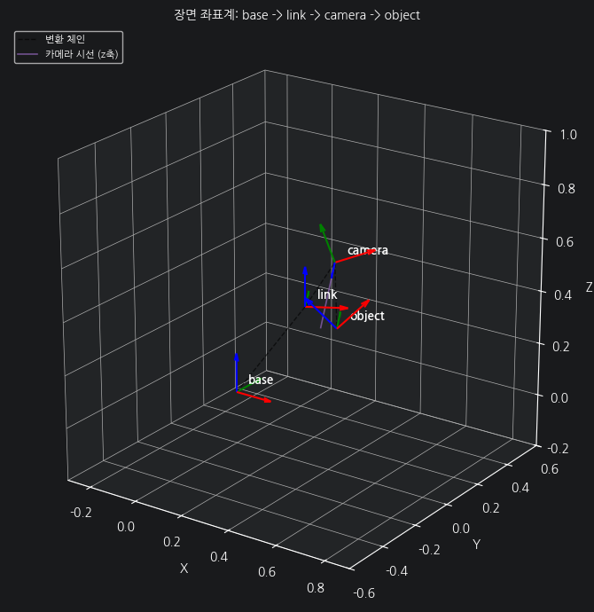
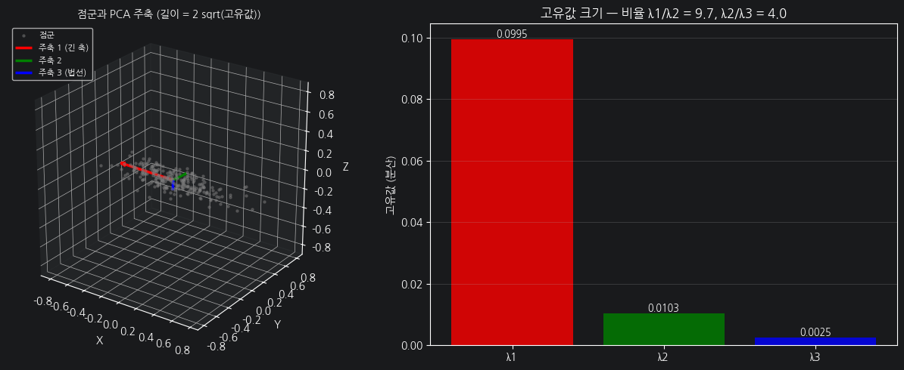
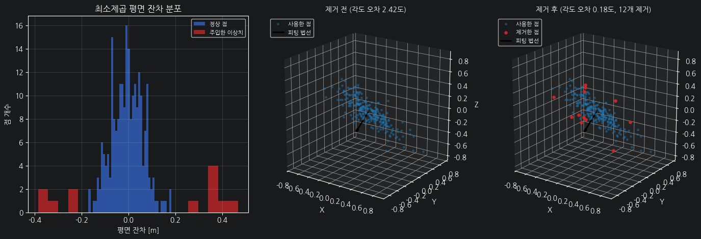
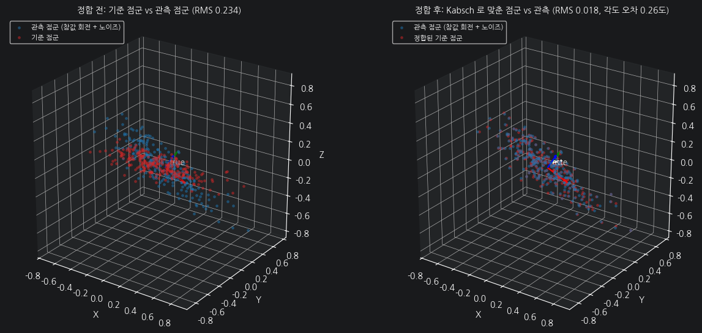
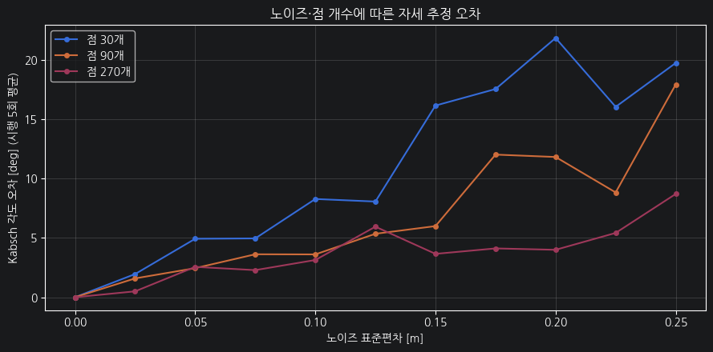
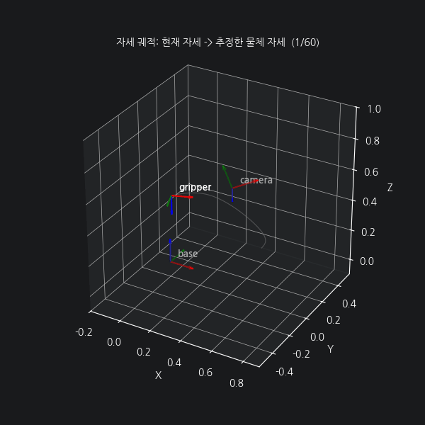
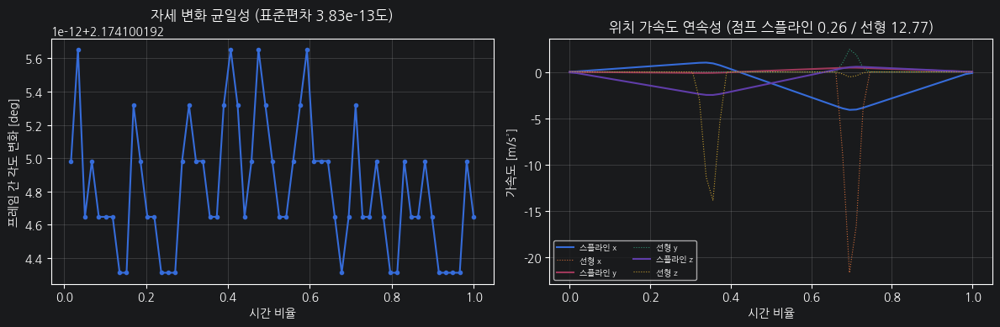

# 모듈 ④ 발표 자료 — 픽앤플레이스 자세 추정과 궤적 생성

> 이 파일을 `presentation.md` 로 복사해 채우세요. 다섯 절은 모두 필수입니다.
> 문제 6 의 검증 셀이 `presentation.md` 의 존재와 다섯 절 제목을 확인합니다.
> 이름: 김현하 / 제출일: 2026-09-10

---

## 1. 파이프라인 전체 구조

- 좌표계 체인 (base -> link -> camera -> object) 그림 또는 다이어그램: 01 노트북 1-3 그림 참조
  
- 각 노트북·모듈이 맡는 역할: 01 PosePipeline 변환, 02 SLERP+스플라인 보간, 03 PCA/Kabsch 추정+애니메이션 시연
- 데이터 흐름: 카메라 점군 -> `PosePipeline` -> base 점군 -> PCA/Kabsch -> 목표 자세 -> SLERP + 스플라인 -> 애니메이션
- 모듈 ③ 에서 가져온 함수: rotation/transform/coordinate_chain 전부. 새로 만든 함수: PosePipeline, quaternion 5종, trajectory 4종, pose_estimation 4종

## 2. 자세 추정 결과와 오차

- PCA 주축 3개와 고유값: x축 나란 주축, 고유값 [0.0995, 0.0103, 0.0025] (표준편차 추정 0.315, 0.101, 0.050)
  
- Kabsch 로 추정한 회전과 참값 사이 각도 오차: 0.258 도, 병진 오차: 0.00009 m
- 이상치 제거 전후 오차: 2.416도 -> 0.185도
  
- 정합 전후 그림 (03 노트북 캡처): 5-3 그림 참조, RMS 0.234 -> 0.018
  

## 3. 노이즈·점 개수가 정확도에 미친 영향

- 노이즈 0 ~ 0.25 스윕에서 오차가 어떻게 커졌는가: 노이즈에 비례해 증가, 점이 많을수록(270개) 기울기가 완만
- 점 개수 30 / 90 / 270 계열 비교: 고노이즈에서 270개가 30개보다 2배 이상 정확
- 구형 점군에서 PCA 주축이 불안정해진 이유: 고유값이 거의 같아(λ1/λ2=1.19) 주축 방향이 정해지지 않음. 흔들림 72.7도 vs 길쭉 2.5도
- 오차 그래프 (03 노트북 캡처): 5-4 그래프 참조
  

## 4. 현재 구현의 한계

- 자세 추정: 대응이 알려진 경우에만 Kabsch 동작. 대칭 물체에서 PCA 축 부호 모호. 평면 피팅은 z= ax+by+c 모델이라 수직 평면 불가
- 궤적 생성: 충돌·관절 한계 미고려. 속도·가속도 상한 미반영 (5차 다항식은 해석값만 보장)
- 파이프라인: 관절 1개(z축) 단순화. 카메라 캘리브레이션·노이즈 무시
- 시연: 오프라인 궤적 재생. 실시간 센서 연동 없음
  
  

## 5. 개선한다면 무엇을 어떻게

- 대응 없는 정합 (무엇을) -> ICP 로 대응부터 찾기 (어떻게)
- RANSAC 평면 피팅으로 이상치에 더 강하게
- 최소 저크 궤적으로 가속도 연속성 개선
- 개선 효과를 어떻게 측정할 것인지: 각도 오차·RMS·가속도 점프 동일 지표로 전후 비교

---

### 부록 — 재현 정보

- Python / 주요 패키지 버전 (`requirements.txt`): 01 노트북 pip freeze 출력 참조
- 난수 시드: `np.random.default_rng(42)`
- 세 노트북 Restart Kernel and Run All 통과 여부: 전부 통과
- `demo.gif` 프레임 수: 60
